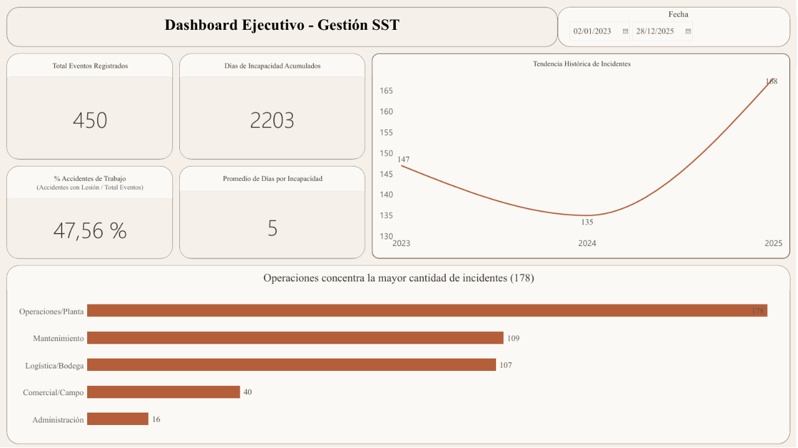
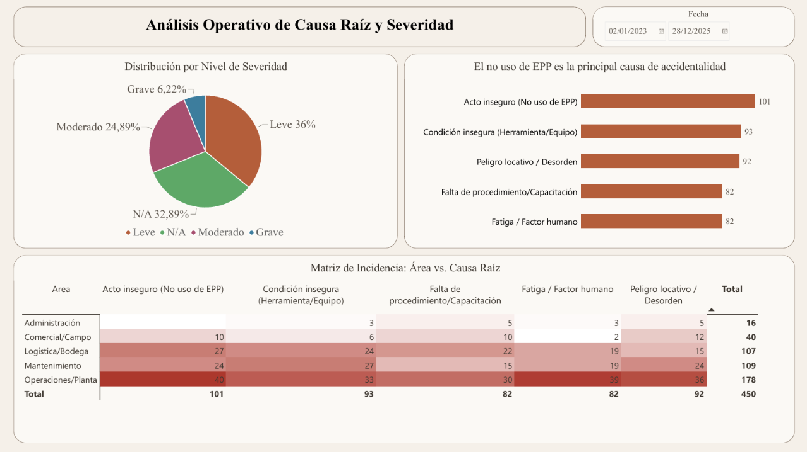

# Dashboard de Indicadores de Seguridad y Salud en el Trabajo (SST)

## Contexto

Este proyecto replica la metodología de análisis de datos que utilicé durante mi experiencia en consultoría de SST. El objetivo es transformar los registros operativos de eventos laborales en indicadores clave de gestión para prevenir riesgos en entornos industriales.

*Nota: Por acuerdos de confidencialidad, los datos presentados corresponden a un dataset sintético generado en Python con distribuciones de frecuencia y severidad realistas.*

## Pregunta de Negocio

- ¿Qué áreas concentran el mayor número de incidentes y días de incapacidad?
- ¿Cuáles son las causas raíz más frecuentes en los accidentes laborales?
- ¿Cómo evoluciona la accidentalidad en el tiempo para evaluar la efectividad de las medidas preventivas?

## Herramientas Utilizadas

- **Python (Pandas, NumPy, SQLite3):** Generación del dataset sintético y procesamiento de consultas analíticas.
- **SQL:** Consultas estructuradas para agregación de días perdidos, frecuencia y distribución por causa raíz.
- **Power BI:** Modelado e implementación de un dashboard interactivo de dos páginas.

## Estructura del Proyecto

```
01-seguridad-salud-trabajo/
├── README.md
├── incidentes_sst.csv        # Dataset sintético (crudo)
├── sst_database.db           # Base de datos SQLite tras carga y limpieza
├── generar_datos_sst.py      # Script de generación del dataset sintético
├── ejecutar_sql.py           # Script de carga y consultas SQL analíticas
├── Dashboard_SST.pbix        # Dashboard interactivo (Power BI)
└── img/
    ├── pagina1.png
    └── pagina2.png
```

## Estructura del Dashboard
##Vinculo del Dashboard

### Página 1: Resumen Ejecutivo (Monitoreo General)

Diseñada para la alta gerencia. Permite evaluar de un vistazo el volumen total de eventos, la severidad acumulada en días de incapacidad, la tendencia histórica y la distribución por área.



### Página 2: Diagnóstico Operativo y Causa Raíz

Diseñada para el equipo técnico de SST. Analiza la composición de severidad (Leve, Moderado, Grave) y clasifica las causas raíz principales (actos y condiciones inseguras) para priorizar planes de capacitación y controles operativos.



## Principales Hallazgos (Dataset Simulado)

1. **Área crítica:** Operaciones/Planta y Mantenimiento concentran en conjunto cerca del 64% de los 450 incidentes totales (178 y 109 casos respectivamente), muy por encima de Logística/Bodega (107), Comercial/Campo (40) y Administración (16).
2. **Causa raíz principal:** Los *Actos Inseguros (No uso de EPP)* son la causa más frecuente con 101 casos, seguidos de cerca por *Condiciones Inseguras (Herramienta/Equipo)* con 93 y *Peligro Locativo/Desorden* con 92.
3. **Calidad del dato en severidad:** El 32,89% de los eventos no cuenta con clasificación de severidad (N/A), un hallazgo relevante en sí mismo que evidencia una oportunidad de mejora en el proceso de reporte y captura de datos en campo.
4. **Carga de incapacidad:** Se acumularon 2.203 días de incapacidad en el periodo analizado, con un promedio de 5 días por evento incapacitante. Cruzar esta variable con severidad y área queda como línea de análisis a profundizar (ver "Próximos pasos").

## Próximos Pasos

- Cruzar días de incapacidad por severidad y área para identificar dónde se concentra el mayor impacto en tiempo perdido.
- Investigar y reducir el porcentaje de eventos sin severidad clasificada (N/A).
- Automatizar la carga de nuevos registros mediante el script `ejecutar_sql.py` para actualizar el dashboard de forma recurrente.
