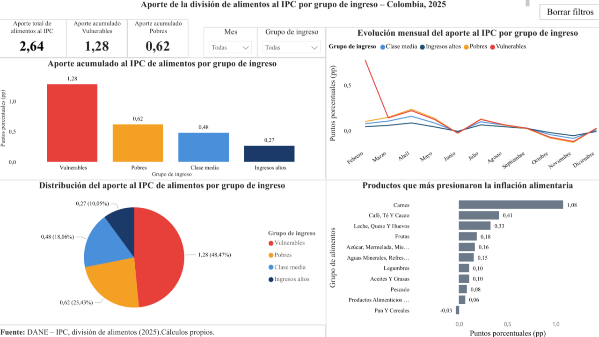

# Aporte de la División de Alimentos al IPC por Grupo de Ingreso — Colombia, 2025

## Contexto

Este proyecto analiza cómo la inflación de la división de alimentos impacta de forma diferenciada a los hogares colombianos según su nivel de ingreso (Vulnerables, Pobres, Clase media e Ingresos altos), usando datos del IPC del DANE para el año 2025. El objetivo es evidenciar que el peso de la inflación de alimentos no se distribuye de forma equitativa entre grupos socioeconómicos.

Este es el proyecto insignia de mi portafolio de análisis de datos.

## Pregunta de Negocio

- ¿Qué grupo de ingreso asume la mayor carga del aumento en precios de alimentos?
- ¿Cómo evoluciona esa carga mes a mes a lo largo de 2025?
- ¿Qué productos específicos explican los picos de inflación alimentaria en cada grupo?

## Fuente de Datos

**DANE — Índice de Precios al Consumidor (IPC), división de alimentos, 2025.**

> **Nota sobre trazabilidad:** los datos provienen de los anexos mensuales de IPC publicados en la [página oficial del DANE](https://www.dane.gov.co/index.php/estadisticas-por-tema/precios-y-costos/indice-de-precios-al-consumidor-ipc). El proceso consistió en descargar el anexo de cada mes de 2025 y unificar esas tablas mensuales en un solo dataset consolidado por año. Los archivos Excel originales de cada mes no se conservan en este repositorio; los datos consolidados están disponibles en `data/processed/`.

## Herramientas Utilizadas

- **Power BI:** modelado del dato y construcción del dashboard interactivo.
- **DAX / Power Query:** cálculo de aportes ponderados al IPC por grupo de ingreso, mes y producto.

## Estructura del Proyecto

```
02-inflacion-alimentos/
├── README.md
├── data/
│   └── processed/
│       ├── aporte_ipc_por_grupo_ingreso.csv     # Resumen: Mes, Clase_social, Aporte
│       └── aporte_ipc_por_producto_y_grupo.csv  # Detalle: Codigo, Producto, Mes, Contribución al IPC, Clase_social
├── Dashboard_Inflacion_Alimentos.pbix
└── img/
    └── dashboard_inflacion.png
```

## Estructura del Dashboard

Dashboard de una página con seis componentes:

- **KPIs:** aporte total de alimentos al IPC (2,64 pp), aporte acumulado de hogares Vulnerables (1,28 pp) y de hogares Pobres (0,62 pp).
- **Aporte acumulado por grupo de ingreso (barras):** compara el impacto absoluto entre los cuatro grupos.
- **Evolución mensual del aporte al IPC (línea):** muestra la trayectoria mes a mes de cada grupo, con un pico marcado en febrero para el grupo Vulnerables.
- **Distribución del aporte (pie chart):** participación porcentual de cada grupo sobre el total.
- **Productos que más presionaron la inflación alimentaria (barras horizontales):** ranking acumulado anual por producto.



🔗 [Ver dashboard interactivo en Power BI](https://app.powerbi.com/view?r=eyJrIjoiYTg0MWMyZWMtNTdmYS00MjhmLWFhMTAtZDM3MGQ2NjY5YzhiIiwidCI6ImZkNzY2ZWRkLThiZWEtNGM5OS04NjcyLTU2ZDFjYWJjMjcwNiIsImMiOjR9)

## Principales Hallazgos

1. **Carga regresiva:** el 48,47% del aporte total de alimentos al IPC (1,28 pp de 2,64 pp) recae sobre los hogares Vulnerables. Los hogares Pobres aportan 0,62 pp (23,43%), Clase media 0,48 pp (18,06%) e Ingresos altos apenas 0,27 pp (10,05%).
2. **Febrero como mes crítico:** en el detalle por producto, **Carnes** (0,35 pp) y **Pan y Cereales** (0,17 pp) son, por amplio margen, los mayores contribuyentes al pico de febrero en el grupo Vulnerables, seguidos de Leche, Queso y Huevos (0,11 pp) y Legumbres (0,09 pp).
3. **Café, Té y Cacao — presión sostenida, no puntual:** a diferencia de Carnes, el aporte de este grupo de productos se mantiene relativamente estable mes a mes en vez de concentrarse en un solo pico, lo que sugiere una presión inflacionaria persistente más que un choque temporal.
4. **Junio, octubre y noviembre** muestran aportes negativos en todos los grupos, es decir, meses de alivio relativo en el costo de la canasta alimentaria.
5. **Carnes** es, en términos acumulados del año, el producto individual que más presiona la inflación alimentaria (1,08 pp), muy por encima de Café-Té-Cacao (0,41 pp) y Leche-Queso-Huevos (0,33 pp).

## ¿Por qué importa esto?

Mirar solo el promedio de inflación oculta quién asume realmente el costo. Las cifras muestran que los hogares más vulnerables enfrentan una presión de precios varias veces mayor que los hogares de ingresos altos frente al mismo fenómeno inflacionario.

- **Para el gobierno:** diseñar políticas más focalizadas por grupo de ingreso, con atención especial a meses críticos como febrero.
- **Para ONG y programas sociales:** priorizar el acceso a alimentos básicos (carnes, cereales, lácteos) en hogares vulnerables como medida de mitigación directa.

## Próximos Pasos


- Ampliar el análisis a 2024 para evaluar si el patrón de carga regresiva se mantiene entre años.

