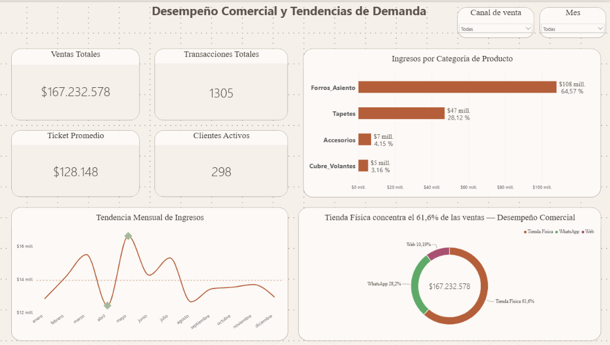
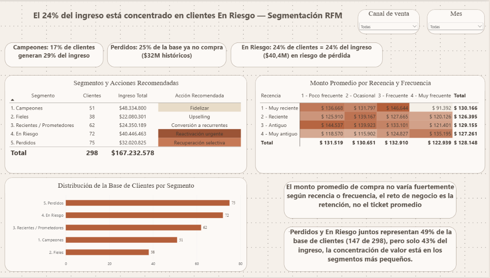

# Análisis Comercial y Segmentación de Clientes (Modelo RFM) - Interforros

## Contexto

Este proyecto aplica técnicas de análisis de datos y modelado RFM (Recencia, Frecuencia, Monto) para un negocio de retail especializado en accesorios automotrices (Interforros). El objetivo es transformar registros transaccionales crudos en insights accionables, aplicando principios de Data Storytelling para facilitar la toma de decisiones gerenciales.

## Pregunta de Negocio

* ¿Qué categorías de productos y canales de venta generan la mayor facturación y dónde existen oportunidades para mejorar el desempeño comercial?
* ¿Cómo se distribuye la cartera de clientes según su comportamiento histórico de compra, lealtad y riesgo de abandono?
* ¿Qué acciones estratégicas inmediatas deben implementarse para maximizar la retención y proteger el capital estancado?

## Herramientas Utilizadas

* Python (Pandas): Análisis Exploratorio de Datos (EDA), limpieza de la base transaccional y cálculo algorítmico de los scores RFM.
* Power BI: Modelado relacional, creación de medidas dinámicas (DAX) y diseño del dashboard interactivo.
* Data Storytelling: Aplicación de metodologías de diseño visual (basadas en Cole Nussbaumer Knaflic) orientadas a reducir el ruido visual y destacar hallazgos mediante títulos declarativos.

## Estructura del Proyecto

03-Interforros-rendimiento-rfm/
├── README.md
├── ventas_retail.csv             # Dataset crudo original con transacciones
├── 01_Limpieza_y_RFM.py          # Script de Python para limpieza y cálculo RFM
├── ventas_limpias.csv            # Dataset procesado, libre de atípicos y errores
├── rfm_clientes_limpio.csv       # Tabla dimensional de clientes segmentados
├── Interforros.pbix              # Dashboard interactivo en Power BI
└── img/
    ├── Rendimiento.png           # Captura de la página 1
    └── RFM.png                   # Captura de la página 2

## Estructura del Dashboard

[Ver dashboard interactivo en Power BI](https://app.powerbi.com/view?r=eyJrIjoiZWIwNzYwY2EtNWYzYS00YWM1LTlmNzItMTFlMDM3MjEwY2UzIiwidCI6ImZkNzY2ZWRkLThiZWEtNGM5OS04NjcyLTU2ZDFjYWJjMjcwNiIsImMiOjR9)

**Página 1: Resumen Ejecutivo (Rendimiento Comercial)**
Diseñada para evaluar de un vistazo el volumen total de ventas. Permite identificar la dependencia financiera por categoría de producto, la distribución de ingresos por canal y la tendencia o estacionalidad mensual de la facturación.

**Página 2: Diagnóstico de Cartera (Segmentación RFM)**
Diseñada para el equipo comercial y estratégico. Analiza la composición de los clientes mediante una matriz de calor (Recencia vs. Frecuencia) y clasifica la base en cinco segmentos clave, asociando el ingreso histórico retenido con recomendaciones tácticas directas.

## Principales Hallazgos

* Dominio de categoría: Los Forros de Asiento son el motor financiero indiscutible del negocio, concentrando el 64,57% de los ingresos totales ($108 millones).
* Dependencia del canal físico: La tienda física concentra el 61,6% de la facturación, mientras que la Web representa el 10,19%. Esta concentración sugiere una oportunidad para evaluar estrategias de crecimiento digital y diversificación de canales.
* Ingresos históricos expuestos: Los clientes clasificados como "En Riesgo" generaron históricamente $40,4 millones, equivalentes al 24% de los ingresos analizados. Esto representa una oportunidad prioritaria de retención debido al valor económico asociado a este grupo
* Fuga de clientes: Los segmentos "Perdidos" y "En Riesgo" suman en conjunto el 49% de la base de clientes (147 de 298), confirmando que el reto principal del negocio es la retención, dado que el ticket promedio no muestra variaciones drásticas entre grupos.
* Estacionalidad operativa: Se identificó una caída crítica de demanda en el mes de abril, seguida inmediatamente por un pico histórico de ventas en mayo ($17 millones).

## Próximos Pasos

* Ejecutar una campaña de reactivación prioritaria: Enfocar los esfuerzos inicialmente en los 72 clientes clasificados como "En Riesgo", priorizando aquellos con mayor valor monetario histórico y frecuencia de compra, con el objetivo de recuperar clientes estratégicos.
* Diseñar estrategias de recuperación selectiva para clientes perdidos: Implementar acciones de bajo costo para reactivar clientes del segmento "Perdidos", priorizando aquellos que históricamente hayan generado mayores ingresos.
* Impulsar el crecimiento incremental de los canales digitales: Diseñar estrategias de incentivo, como descuentos cruzados, campañas de recompra o beneficios de envío, enfocadas en atraer nuevos clientes y aumentar la recurrencia mediante Web y WhatsApp.
* Fortalecer las oportunidades de venta cruzada: Aprovechar la alta concentración de ingresos en la categoría de Forros de Asiento para identificar productos complementarios que puedan incrementar el valor de cada compra y reducir la dependencia comercial de una única categoría.
* Monitorear el comportamiento temporal de la demanda: Dar seguimiento a la caída observada en abril y al incremento de ventas registrado en mayo durante períodos posteriores, con el fin de determinar si este comportamiento corresponde a un patrón estacional antes de incorporarlo formalmente en la planificación de inventarios.
* Diseñar estrategias de incentivo (descuentos cruzados o envíos gratuitos) para aumentar el volumen de los canales Web y WhatsApp.
*En el período analizado se observa una caída en abril seguida de un incremento significativo en mayo. Este comportamiento debe monitorearse en períodos futuros antes de incorporarlo como patrón estacional.
